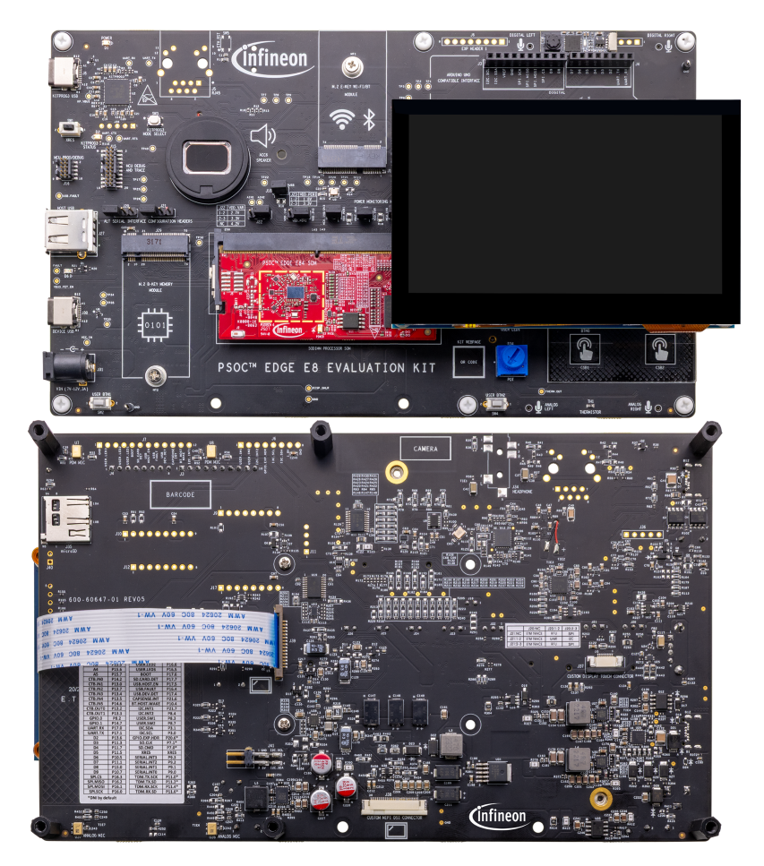
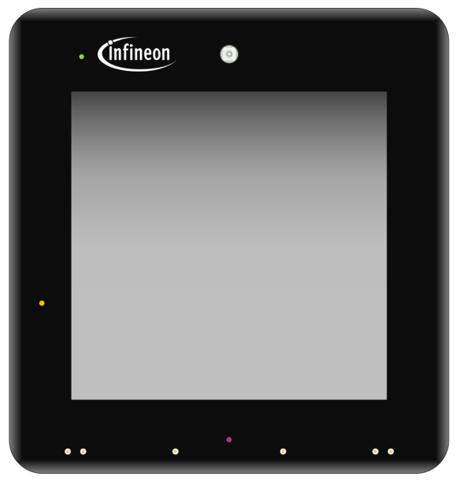
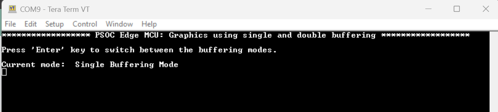

# PSOC&trade; Edge MCU: Graphics using single and double buffering

The code example demonstrates how to use the graphics subsystem of PSOC&trade; Edge MCU to render images on an LCD screen, utilizing either single or double buffering mode:

- **Single buffering:** A single buffer is used for draw and display the image frames sequentially

- **Double buffering:** This process involves using one buffer to create a frame while another buffer is simultaneously utilized to display the previously composed frame. In continuous mode (video burst), the buffers are swapped and used in a ping-pong way in the next iteration.

The double buffering technique provides the advantage of improved throughput over the single buffering technique by removing the flicker effect which may occur in the latter mode due to frames being drawn more quickly than the rate at which they are being displayed. Since the frame drawing and displaying can take place in a parallel manner in double buffering, the flickering is reduced considerably.

This code example uses a 4.3-inch Capacitive Touch IPS Display for Raspberry Pi, DSI Interface, 800x480 pixel from Waveshare connected via the MIPI DSI interface.
> **Note:** This application is built for the 4.3-inch display by default across all BSPs except for KIT_PSE84_HMI. For the KIT_PSE84_HMI, the default display is the ST7701S 4-inch MIPI DSI panel with 512×480 pixel that ships with the kit.

This code example has a three project structure: CM33 secure, CM33 non-secure, and CM55 projects. All three projects are programmed to the external QSPI flash and executed in Execute in Place (XIP) mode. Extended boot launches the CM33 secure project from a fixed location in the external flash, which then configures the protection settings and launches the CM33 non-secure application. Additionally, CM33 non-secure application enables CM55 CPU and launches the CM55 application.
> **Note:** On the KIT_PSE84_HMI, all three projects are programmed to the external OSPI flash instead of QSPI.

[View this README on GitHub.](https://github.com/Infineon/mtb-example-psoc-edge-gfx-single-double-buffering)

[Provide feedback on this code example.](https://yourvoice.infineon.com/jfe/form/SV_1NTns53sK2yiljn?Q_EED=eyJVbmlxdWUgRG9jIElkIjoiQ0UyNDE5MTkiLCJTcGVjIE51bWJlciI6IjAwMi00MTkxOSIsIkRvYyBUaXRsZSI6IlBTT0MmdHJhZGU7IEVkZ2UgTUNVOiBHcmFwaGljcyB1c2luZyBzaW5nbGUgYW5kIGRvdWJsZSBidWZmZXJpbmciLCJyaWQiOiJhZHZhaXRqaXRlbmRyYS5uZXJsaWthckBpbmZpbmVvbi5jb20iLCJEb2MgdmVyc2lvbiI6IjIuMy4xIiwiRG9jIExhbmd1YWdlIjoiRW5nbGlzaCIsIkRvYyBEaXZpc2lvbiI6Ik1DRCIsIkRvYyBCVSI6IklDVyIsIkRvYyBGYW1pbHkiOiJQU09DIn0=)

See the [Design and implementation](docs/design_and_implementation.md) for the functional description of this code example.

## Requirements

- [ModusToolbox&trade;](https://www.infineon.com/modustoolbox) v3.7 or later (tested with v3.8)
- Board support package (BSP) minimum required version: 1.0.0
- Programming language: C
- Associated parts: All [PSOC&trade; Edge MCU](https://www.infineon.com/products/microcontroller/32-bit-psoc-arm-cortex/32-bit-psoc-edge-arm) parts

## Supported toolchains (make variable 'TOOLCHAIN')

- GNU Arm&reg; Embedded Compiler v14.2.1 (`GCC_ARM`) – Default value of `TOOLCHAIN`
- Arm&reg; Compiler v6.22 (`ARM`)
- IAR C/C++ Compiler v9.50.2 (`IAR`)
- LLVM Embedded Toolchain for Arm&reg; v19.1.5 (`LLVM_ARM`)

## Supported kits (make variable 'TARGET')

- [PSOC&trade; Edge E84 Evaluation Kit](https://www.infineon.com/KIT_PSE84_EVAL) (`KIT_PSE84_EVAL_EPC2`) – Default value of `TARGET`
- [PSOC&trade; Edge E84 Evaluation Kit](https://www.infineon.com/KIT_PSE84_EVAL) (`KIT_PSE84_EVAL_EPC4`)
- [PSOC&trade; Edge E84 AI Kit](https://www.infineon.com/KIT_PSE84_AI) (`KIT_PSE84_AI`)
- [PSOC&trade; Edge E84 HMI Kit](https://www.infineon.com/KIT_PSE84_HMI) (`KIT_PSE84_HMI`)

## Hardware setup

This example uses the board's default configuration. See the kit user guide to ensure that the board is configured correctly.

Ensure the following jumper and pin configuration on board.
- BOOT SW must be in the HIGH/ON position
- J20 and J21 must be in the tristate/not connected (NC) position for the PSOC&trade; Edge E84 Evaluation Kit

> **Note:** This hardware setup is not required for KIT_PSE84_AI.

### Supported display and electrical connection with KIT_PSE84_EVAL 

- **Waveshare 4.3 inch Raspberry Pi DSI 800*480 display:**  
  Connect the FPC 15-pin cable between the display connector and the PSOC&trade; Edge E84's RPI MIPI DSI connector as outlined in the table below and shown in Figure 1.

   Kit's name                                      | DSI connector 
  ------------------------------------------------ | --------------
   PSOC&trade; Edge E84 Evaluation Kit             | J39
   PSOC&trade; Edge E84 AI Kit                     | J10

  **Figure 1. Display connection with PSOC&trade; Edge E84 evaluation kit**

  

- **ST7701S 4-inch MIPI DSI 512x480 pixel display (RK040HF001):** This display is by default
  shipped with PSOC&trade; Edge E84 HMI Kit.

   **Figure 2. 4-inch MIPI DSI 512x480 pixel display**

   

## Software setup

See the [ModusToolbox&trade; tools package installation guide](https://www.infineon.com/ModusToolboxInstallguide) for information about installing and configuring the tools package.

Install a terminal emulator if you do not have one. Instructions in this document use [Tera Term](https://teratermproject.github.io/index-en.html).

This example requires no additional software or tools.

## Operation

See [Using the code example](docs/using_the_code_example.md) for instructions on creating a project, opening it in various supported IDEs, and performing tasks, such as building, programming, and debugging the application within the respective IDEs.

1. Ensure that the 4.3-inch Raspberry Pi DSI LCD is connected to the board

2. Connect the board to your PC using the provided USB cable through the KitProg3 USB connector

3. Open a terminal program and select the KitProg3 COM port. Set the serial port parameters to 8N1 and 115200 baud

4. After programming, the application starts automatically. Observe that the UART terminal displays the code example title along with the instruction to exercise single/dual buffering mode as shown in the following figure:

   **Figure 3. Terminal output**

   

5. In both the buffering modes, the LCD displays the Infineon logo and the tiger images alternately, with a delay interval of 2 seconds

   **Figure 4. Output on LCD display**
    
   

6. Press the **Enter** key to switch between the buffering modes. The serial terminal displays the active buffering mode. The switching between the buffering mode may take 2 seconds

## Related resources

Resources  | Links
-----------|----------------------------------
Application notes  | [AN235935](https://www.infineon.com/AN235935) – Getting started with PSOC&trade; Edge E8 MCU on ModusToolbox&trade; software   [AN239191](https://www.infineon.com/AN239191) – Getting started with graphics on PSOC&trade; Edge MCU
Code examples  | [Using ModusToolbox&trade;](https://github.com/Infineon/Code-Examples-for-ModusToolbox-Software) on GitHub
Device documentation | [PSOC&trade; Edge MCU datasheets](https://www.infineon.com/products/microcontroller/32-bit-psoc-arm-cortex/32-bit-psoc-edge-arm#documents)   [PSOC&trade; Edge MCU reference manuals](https://www.infineon.com/products/microcontroller/32-bit-psoc-arm-cortex/32-bit-psoc-edge-arm#documents)
Development kits | Select your kits from the [Evaluation board finder](https://www.infineon.com/cms/en/design-support/finder-selection-tools/product-finder/evaluation-board)
Libraries  | [mtb-dsl-pse8xxgp](https://github.com/Infineon/mtb-dsl-pse8xxgp) – Device support library for PSE8XXGP   [retarget-io](https://github.com/Infineon/retarget-io) – Utility library to retarget STDIO messages to a UART port
Tools  | [ModusToolbox&trade;](https://www.infineon.com/modustoolbox) – ModusToolbox&trade; software is a collection of easy-to-use libraries and tools enabling rapid development with Infineon MCUs for applications ranging from wireless and cloud-connected systems, edge AI/ML, embedded sense and control, to wired USB connectivity using PSOC&trade; Industrial/IoT MCUs, AIROC&trade; Wi-Fi and Bluetooth&reg; connectivity devices, XMC&trade; Industrial MCUs, and EZ-USB&trade;/EZ-PD&trade; wired connectivity controllers. ModusToolbox&trade; incorporates a comprehensive set of BSPs, HAL, libraries, configuration tools, and provides support for industry-standard IDEs to fast-track your embedded application development

 

## Other resources

Infineon provides a wealth of data at [www.infineon.com](https://www.infineon.com) to help you select the right device, and quickly and effectively integrate it into your design.

## Document history

Document title: *CE241919* – *PSOC&trade; Edge MCU: Graphics using single and double buffering*

 Version | Description of change
 ------- | ---------------------
 1.x.0   | New code example   Early access release
 2.0.0   | GitHub release 
 2.1.0   | Added support for KIT_PSE84_AI
 2.2.0   | Updated design files to fix ModusToolbox&trade; v3.7 build warnings
 2.3.0   | Added support for KIT_PSE84_HMI
 2.3.1   | ECO configurations update for KIT_PSE84_HMI
 

All referenced product or service names and trademarks are the property of their respective owners.

The Bluetooth&reg; word mark and logos are registered trademarks owned by Bluetooth SIG, Inc., and any use of such marks by Infineon is under license.

PSOC&trade;, formerly known as PSoC&trade;, is a trademark of Infineon Technologies. Any references to PSoC&trade; in this document or others shall be deemed to refer to PSOC&trade;.

---------------------------------------------------------

(c) 2023-2026, Infineon Technologies AG, or an affiliate of Infineon Technologies AG. All rights reserved.
This software, associated documentation and materials ("Software") is owned by Infineon Technologies AG or one of its affiliates ("Infineon") and is protected by and subject to worldwide patent protection, worldwide copyright laws, and international treaty provisions. Therefore, you may use this Software only as provided in the license agreement accompanying the software package from which you obtained this Software. If no license agreement applies, then any use, reproduction, modification, translation, or compilation of this Software is prohibited without the express written permission of Infineon.
 
Disclaimer: UNLESS OTHERWISE EXPRESSLY AGREED WITH INFINEON, THIS SOFTWARE IS PROVIDED AS-IS, WITH NO WARRANTY OF ANY KIND, EXPRESS OR IMPLIED, INCLUDING, BUT NOT LIMITED TO, ALL WARRANTIES OF NON-INFRINGEMENT OF THIRD-PARTY RIGHTS AND IMPLIED WARRANTIES SUCH AS WARRANTIES OF FITNESS FOR A SPECIFIC USE/PURPOSE OR MERCHANTABILITY. Infineon reserves the right to make changes to the Software without notice. You are responsible for properly designing, programming, and testing the functionality and safety of your intended application of the Software, as well as complying with any legal requirements related to its use. Infineon does not guarantee that the Software will be free from intrusion, data theft or loss, or other breaches (“Security Breaches”), and Infineon shall have no liability arising out of any Security Breaches. Unless otherwise explicitly approved by Infineon, the Software may not be used in any application where a failure of the Product or any consequences of the use thereof can reasonably be expected to result in personal injury.
